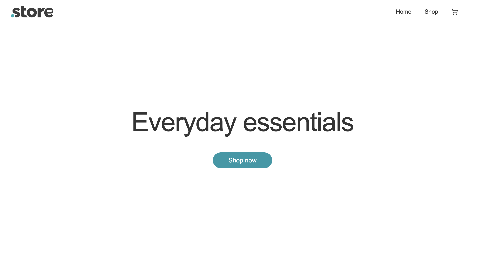
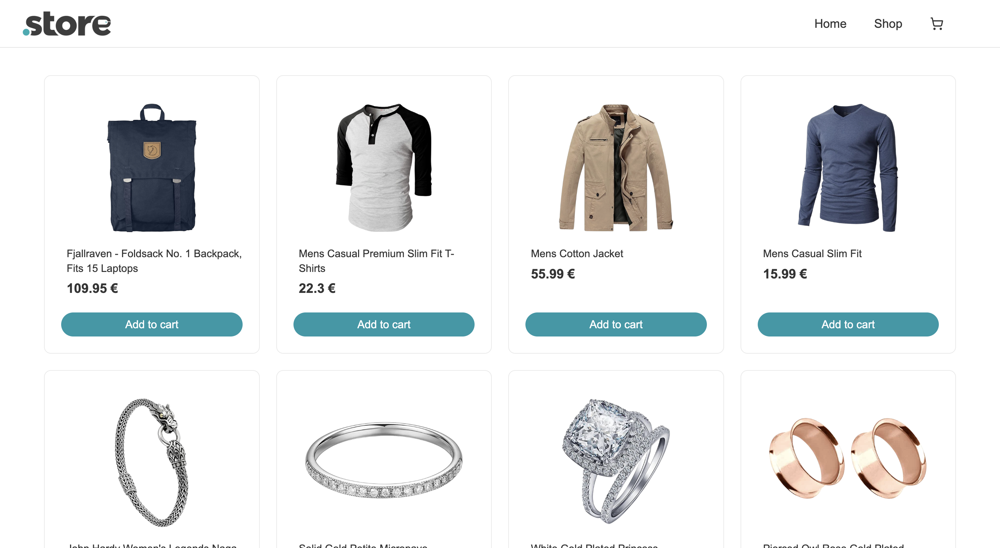
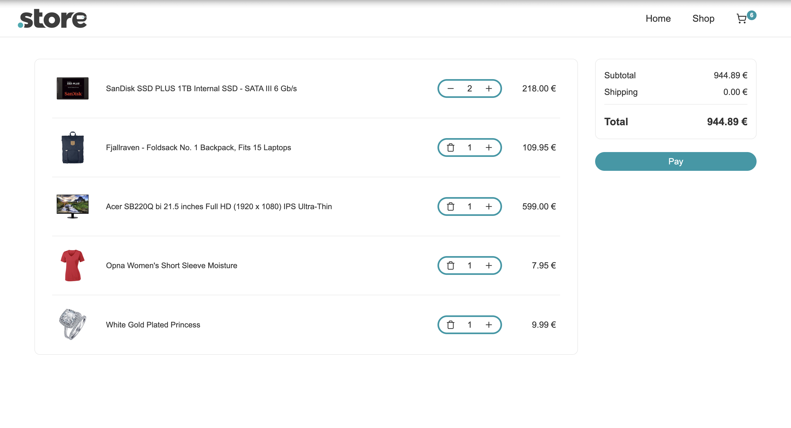

# Store

A shopping cart application built with React.

🔗 [Live Demo](https://store-rho-seven.vercel.app/)

## Screenshots

### Home

### Shop

### Cart

## Features

- Browse products from the FakeStore API
- Add, remove, and update cart items
- Real-time cart counter
- Order summary with subtotal, shipping, and total
- Simulated checkout flow
- Loading and error handling
- Responsive design

## Built with

- React
- React Router
- Vite
- CSS Modules
- Vitest
- React Testing Library

## Data

Products are fetched from the [FakeStore API](https://fakestoreapi.com/).
